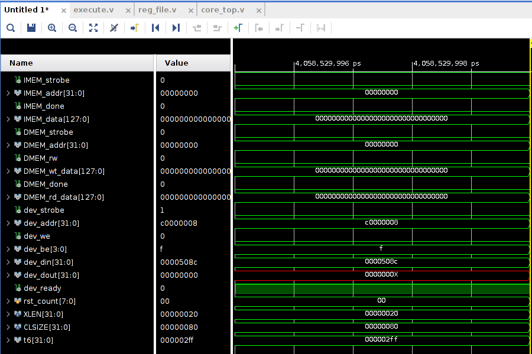

# HW0

I recorded the process of building the environment for this class in detail. My OS is Ubuntu 20.04. The course materilas all under ```material/```.

```
./material
├── aquila_mpd_build.zip    <=== some tcl srcipt written by professor
├── aquila_sw.tgz           <=== homework sw code
├── mpd21_1_RISCV_ISA.pdf   <=== about RISC-V 
└── mpd21_HW0_Simulation of a HW-SW Platform.pdf <=== HW0 spec
```

## HW platform

1. download installer for Linux in: [Here](https://www.xilinx.com/support/download.html), you should have an account before downloading.
2. You will see ```Xilinx_Unified_2021.1_0610_2318_Lin64.bin``` after downloading, which is the installer we need.
3. ```chmod +x Xilinx_Unified_2021.1_0610_2318_Lin64.bin```
4. ```sudo ./Xilinx_Unified_2021.1_0610_2318_Lin64.bin``` and start downloading.
5. Follow ```Vivado Installation Guide``` part in ```mpd21_HW0_Simulation of a HW-SW Platform.pdf``` file. I also recommend you to set up "path" at ```/home/<USERNAME>/Xilinx``` after downloading step. The default path is ```/tools/Xilinx``` which is not convenient.
6. Install Arty Board Definitions, first go to [DownGit](https://downgit.github.io/#/home?url=https:%2F%2Fgithub.com%2FDigilent%2Fvivado-boards%2Ftree%2Fmaster%2Fnew%2Fboard_files%2Farty-a7-35) and paste: ```https://github.com/Digilent/vivado-boards/tree/master/new/board_files/arty-a7-35``` and click on Download.
7. ```$ unzip arty-a7-35.zip```
8. ```$ cd Xilinx/Vivado/2021.1/data/xhub/boards/XilinxBoardStore/boards```
9. ```$ sudo mkdir Digilent```
10. ```$ sudo cp -r ~/arty-a7-35/* . ```
11. download ```aquila_mpd_build.zip``` and unzip.
12. ```$ ~/Xilinx/Vivado/2021.1/bin/vivado -mode batch -source build.tcl```, then generate folder ```aquila_mpd``` in same folder. There should exist a file called ```aquila_mpd.xpr``` under ```aquila_mpd```.
13. open workspace! ```$ ~/Xilinx/Vivado/2021.1/bin/vivado ~/aquila_mpd_build/aquila_mpd/aquila_mpd.xpr```
14. (optional) Using ```alias``` or write to ```~/.bashrc``` to use short command to open workspace!

    ```
    $ alias vivado2021="~/Xilinx/Vivado/2021.1/bin/vivado ~/aquila_mpd_build/aquila_mpd/aquila_mpd.xpr"
    ```

## SW platform

ref to ```sw.sh```. If you encounter some issues when execute ```echo "export PATH=$PATH:/opt/riscv/bin" >> ~/.bashrc \
    && source ~/.bashrc```, you can execute by yourself. It is important to check whether ```/opt/riscv/bin``` exist in ```$PATH``` or not.

## HW0

此次作業要求, 利用 ```uart.v``` module 模擬(一般有板子的情況是以 uart 直接將執行檔傳到板子上直接執行) 真正 uart 並且跑 Dhrystone 測試得到 DMIPS/Mhz 後存入 register 中方便我們觀察數值, 也就是將 Dhrystone 變成開機程式, 讓我們一開機時馬上就執行, 並且透過 register 查看 DMIPS, 主要工作為 trace code 並且理解 RISC-V ISA

### checkout

* [x] Disable ```printf```: 老師很好心地幫我們處理這塊, 我們只要透過 ```#define PRINT_MSG 1``` 就可以控制是否可以輸出
* [x] only integer computation are used: 根據 DMIPS/Mhz 數值約為從 0.00~15.00 的範圍, 使用浮點數運算太過浮誇, 且 Aquila 不支援浮點數運算, 可以採用 ```scaled fixed-point arithmetic``` 的方式去處理 DMIPS/Mhz, 也就是先將浮點數變成整數後先存進 register, 最後在除即可拿到當初的浮點數內容
* [x] The DMIPS/MHz value (scaled to an integer) can be stored in a register so that the simulator can show its value


而我們一開始得到 ```aquila_sw``` 的資料內容如下:

```
aquila_sw
├── Dhrystone   <==== Dhrystone source code
├── elibc       <==== little libc
└── uartboot    <==== 
```

### Dhrystone

Dhrystone 作者提到這份用 C 重新選寫的程式會依賴於底下 lib:
1. strcpy: in measurement loop
2. strcmp: in measurement loop
3. printf
4. scanf
5. times() or time(): exe time measurement

同時也應該注意的點是 Dhrystone 基本適用於 PC, 如果要將 Dhrystone 移動到嵌入式平台上使用, 需要修改計時, print 的內容以及移除 I/O 內容

Dhrystone 下面包含下列內容, 目的是要產出可執行檔例如 ```dhry.ebf```, 接著最後才生成 memory file 丟入 Vivado 模擬

```
.
├── create_ebf.sh
├── dhry_1.c
├── dhry_2.c
├── dhry.h          <=== containing global definitions and comments
├── dhry.ld         <=== linker script for exetable file
├── Makefile        
├── RATIONALE
└── VARIATIONS
```

### uartboot

* source code in ```uartboot``` folder, 檔案結構:

```
.
├── boot.c        <=== entry point of the boot code 
|               (因此一定要放在 linker script 中 text 最開始處)
├── bootrom.ld
├── create_mem.sh <=== create <name>.mem memory from <name>.bin
├── io_uart.c
├── io_uart.h
├── Makefile
└── uartboot.c
```

* boot.c
    * 註解已經詳細說明, 這是整個 uartboot 的進入點, 且**必須要放在 linker script 中 text section 的最開始處**, 裡面短短幾行 code 的用處就是用來 setting stack ptr
    * boot.c 要先拿到 linker script 內部的 ```_stack_top``` variable, 需要注意的是在 linker script 內部 "variable" 的概念與一般程式不同, 在 linker script 內 variable 為 symbol, 如果我們要從外部去 access linker script 內的 symbol 需要使用 ```&```, 因為在 linker script 內部 "symbol" 是個沒有 value 沒有 assign memory, **they are an address without a value**, ref to [How to access variable define in linker script in c?](https://stackoverflow.com/questions/39998485/how-to-access-variable-define-in-linker-script-in-c/44086338), [ld manual](https://sourceware.org/binutils/docs/ld/Source-Code-Reference.html):
        ```
        extern unsigned int __stack_top; /* declared in the linker script */
        unsigned int stack_top = (unsigned int) &__stack_top;
        ```
* bootrom.ld
    * linker script, try ```man ld``` if you don't know
        * ```ld combines a number of object and archive files, relocates their data and ties up symbol references. Usually the last step in compiling a program is to run ld.```
    * terminology
        * linker script: 讓 linker 知道如何做 link 
        * object file: 
            1. machine code output from the compilation phase (```-c```)
            2. **usually relocatable, and not usually directly executable**
            2. linker take object files and archive file to form executable file.
        * archive file:
            1. archive one or more than one files to one file
        * section: section in every object file
            1. ```.bss```: 沒有初始化的變數
            2. ```.text```: code after compiling
            3. ```.data```: 有初始化的變數
        * **location counter** (```.```): 在 linker script 中以 ```.``` 表示當前的 location address
            1. 當 ```SECTION``` 開始時初始為 0
            2. 隨著 output section 內容增加而變大
            3. **可以自行 assign 值給 location counter**

    * MEMORY
        ```
        MEMORY
        {
            code_ram   (rx!rw) : ORIGIN = 0x00001000, LENGTH = 0x5000
            data_ram   (rw!x)  : ORIGIN = 0x00006000, LENGTH = 0x4000
        }
        ```
        * 真正執行的實體機器的區塊(region)
        * 設定 memory section attribute, origin address, memory length, 語法為:
            ```
            name [(attr)] : ORIGIN = origin, LENGTH = len
            ```
            * attr:
                1. ```R```: read only
                2. ```W```: read and write
                3. ```X```: executable
                4. ```A```: allocate
                5. ```!```: reverse
            * len: region size, unit is **byte**

    * SECTION
        ```
        SECTIONS
        {
            .text :
            {
                boot.o(.text)
                *(.text)

            } > code_ram

            .data :
            {
                *(.data)
                *(.bss)
                *(.rodata*)

            } > data_ram
        }
        ```
        * ```SECTION``` 描述 **輸出 object file** 內有什麼 section, 這邊顯示輸出的 object file 的 ```.text``` section 要先放 ```boot.o``` object file 的 ```.text``` section, 再存放所有 input object file 的 ```.text``` section
        * ```> code_ram```: 講此 output file object 的 text section 放入 ```code_ram``` 的 region

## implement

比照 ```uartboot/``` 的作法, 將整套作法搬到 Dhrystone 中

1. copy ```create_mem.sh```, ```boot.c``` to ```Dhrystone/```
2. update ```Dhrystone/Makefile```, 最後面加上執行 create_mem.sh 的指令
3. 修改 dhry.ld, 程式進入點改為 boot.c, 並且修改起始位置 (開機程式從0開始)
4. 修改 ```dhry_1.c```, 嵌入組語讓數值存到 register
5. copy ```dhry.mem``` to Vivado 模擬

最後迴圈只跑 200 次的情況下大約 DMIPS 為 **0.767**:



## ref

* linker script
    * [GNU ld的linker script簡介](https://www.slideshare.net/zzz00072/gnu-ldlinker-script?next_slideshow=1)
    * [Linker Script初探 - GNU Linker Ld手冊略讀](http://wen00072.github.io/blog/2014/03/14/study-on-the-linker-script/)
    * [10分鐘讀懂 linker scripts](https://blog.louie.lu/2016/11/06/10%E5%88%86%E9%90%98%E8%AE%80%E6%87%82-linker-scripts/)