# HW2

- [HW2](#hw2)
  * [init](#init)
  * [optimize](#optimize)
    + [freebsd c code](#freebsd-c-code)
    + [change strcpy asm sequence](#change-strcpy-asm-sequence)
    + [unroll strcpy](#unroll-strcpy)
  * [summary](#summary)

## init

* new lib code:
    * 有兩個檔案更新給我們, 分別是 ```material/uart.v``` 與 ```material/stdlib.c```, ```uart.v``` 貼到 Vivado 那邊即可, ```stdlib.c``` 則是替換掉 ```elibc/stdlib.c```, 兩者的差異是新版本的會在 ```exit()``` 被呼叫後停下 
    * 新舊板 stdlib.c 差異

        ```
        > 
        >     // If Aquila is running in waveform simulator, we can use putchar(03) to
        >     // inform the simulator to end simulation if exit() has been called.
        >     // However, you need a UART module that invokes $finish() when a 0x03 code
        >     // has been sent to the UART device in simulation mode.
        >     putchar(03);
        > 
        ```

* 將 ```material/aquila_sw.tgz``` 重新 copy 過來 ```HW1/```, 記得別用到 HW0 模擬的 code, 記得將 ```elibc/stdlib.c``` 替換掉
* 傳到 FPGA 上測試：
    1. Vivado connect to hardware by ```Auto connect```
    2. Generating bit file
    3. ```Program device``` send bit file from host to FPGA
    4. Using serial port terminal to display UART output, choose the port
    5. ```cat dhry.ebf > /dev/ttyUSB1``` and check on serial port terminal
* initial test value: **0.72**

    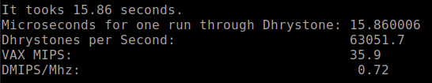

## analyze

### c/asm code after init

* 這次作業允許我們對 ```elibc/strcmp()``` 與 ```elibc/strcpy()``` 做優化, 下面附上 init 做完後原始的狀態
    * ```elibc/strcpy()```
        * c code
            ```c
            char *strcpy(char *dst, char *src)
            {
                char *tmp = dst;

                while (*src) *(tmp++) = *(src++);
                *tmp = 0;
                return dst;
            }
            ```
        * RISC-V code
            ```asm
            00001ea0 <strcpy>:
            1ea0:	0005c783          	lbu	a5,0(a1)
            1ea4:	00050713          	mv	a4,a0
            1ea8:	00078c63          	beqz	a5,1ec0 <strcpy+0x20>
            1eac:	00170713          	addi	a4,a4,1
            1eb0:	00158593          	addi	a1,a1,1
            1eb4:	fef70fa3          	sb	a5,-1(a4)
            1eb8:	0005c783          	lbu	a5,0(a1)
            1ebc:	fe0798e3          	bnez	a5,1eac <strcpy+0xc>
            1ec0:	00070023          	sb	zero,0(a4)
            1ec4:	00008067          	ret
            ```
    * ```elibc/strcmp()```
        * c code
            ```c
            int  strcmp(char *s1, char *s2)
            {
                int value;
            
                s1--, s2--;
                do
                {
                    s1++, s2++;
                    if (*s1 == *s2)
                    {
                        value = 0;
                    }
                    else if (*s1 < *s2)
                    {
                        value = -1;
                        break;
                    }
                    else
                    {
                        value = 1;
                        break;
                    }
                } while (*s1 != 0 && *s2 != 0);
                return value;
            }
            ```
        * RISC-V code
            ```asm
            00001fb8 <strcmp>:
            1fb8:	fff50513          	addi	a0,a0,-1
            1fbc:	fff58593          	addi	a1,a1,-1
            1fc0:	0080006f          	j	1fc8 <strcmp+0x10>
            1fc4:	02078663          	beqz	a5,1ff0 <strcmp+0x38>
            1fc8:	00150513          	addi	a0,a0,1
            1fcc:	00158593          	addi	a1,a1,1
            1fd0:	00054783          	lbu	a5,0(a0)
            1fd4:	0005c703          	lbu	a4,0(a1)
            1fd8:	fee786e3          	beq	a5,a4,1fc4 <strcmp+0xc>
            1fdc:	fff00513          	li	a0,-1
            1fe0:	00e7f463          	bleu	a4,a5,1fe8 <strcmp+0x30>
            1fe4:	00008067          	ret
            1fe8:	00100513          	li	a0,1
            1fec:	00008067          	ret
            1ff0:	00000513          	li	a0,0
            1ff4:	00008067          	ret
            ```
    * get from gtkterm:
        ```
        =======================================================================
        Copyright (c) 2019-2020, EISL@NCTU, Hsinchu, Taiwan.
        The Aquila SoC is ready to go.
        Waiting for a program to be sent from the UART ...
        Aquila executes code at 0x1000, size = 0x59FC bytes.
        -----------------------------------------------------------------------

        Dhrystone Benchmark, Version 2.1 (Language: C)

        Program compiled without 'register' attribute

        Execution starts, 1000000 runs through Dhrystone
        Execution ends

        Final values of the variables used in the benchmark:

        Int_Glob:            5
                should be:   5
        Bool_Glob:           1
                should be:   1
        Ch_1_Glob:           c
                should be:   c
        Ch_2_Glob:           c
                should be:   c
        Arr_1_Glob[8]:       7
                should be:   7
        Arr_2_Glob[8][7]:    1000010
                should be:   Number_Of_Runs + 10
        Ptr_Glob->
        Ptr_Comp:          40964
                should be:   (implementation-dependent)
        Discr:             0
                should be:   0
        Enum_Comp:         2
                should be:   2
        Int_Comp:          17
                should be:   17
        Str_Comp:          DHRYSTONE PROGRAM, SOME STRING
                should be:   DHRYSTONE PROGRAM, SOME STRING
        Next_Ptr_Glob->
        Ptr_Comp:          40964
                should be:   (implementation-dependent), same as above
        Discr:             0
                should be:   0
        Enum_Comp:         1
                should be:   1
        Int_Comp:          18
                should be:   18
        Str_Comp:          DHRYSTONE PROGRAM, SOME STRING
                should be:   DHRYSTONE PROGRAM, SOME STRING
        Int_1_Loc:           5
                should be:   5
        Int_2_Loc:           13
                should be:   13
        Int_3_Loc:           7
                should be:   7
        Enum_Loc:            1
                should be:   1
        Str_1_Loc:           DHRYSTONE PROGRAM, 1'ST STRING
                should be:   DHRYSTONE PROGRAM, 1'ST STRING
        Str_2_Loc:           DHRYSTONE PROGRAM, 2'ND STRING
                should be:   DHRYSTONE PROGRAM, 2'ND STRING

        It tooks 15.86 seconds.
        Microseconds for one run through Dhrystone: 15.860006 
        Dhrystones per Second:                      63051.7 
        VAX MIPS:                                   35.9 
        DMIPS/Mhz:                                   0.72
        ```

### analyzing


## optimize

### freebsd c code

1. [Freebsd strcpy](https://github.com/freebsd/freebsd-src/blob/master/lib/libc/string/strcpy.c)
    * 單獨替換後 DMIPS 上升至 **0.74**
    ```c
    (char * __restrict to, const char * __restrict from)
    {
        char *save = to;

        for (; (*to = *from); ++from, ++to);
        return(save);
    }
    ```
    ```asm
    00001ea0 <strcpy>:
    1ea0:	0005c783          	lbu	a5,0(a1)
    1ea4:	00f50023          	sb	a5,0(a0)
    1ea8:	00078e63          	beqz	a5,1ec4 <strcpy+0x24>
    1eac:	00050793          	mv	a5,a0
    1eb0:	00158593          	addi	a1,a1,1
    1eb4:	0005c703          	lbu	a4,0(a1)
    1eb8:	00178793          	addi	a5,a5,1
    1ebc:	00e78023          	sb	a4,0(a5)
    1ec0:	fe0718e3          	bnez	a4,1eb0 <strcpy+0x10>
    1ec4:	00008067          	ret
    ```
2. [Freebsd strcmp](https://github.com/freebsd/freebsd-src/blob/master/lib/libc/string/strcmp.c):
    * 單獨替換後 DMIPS 上升至 **0.74**
    ```c
    while (*s1 == *s2++)
		if (*s1++ == '\0')
			return (0);
	return (*(const unsigned char *)s1 - *(const unsigned char *)(s2 - 1));
    ```

### change strcpy asm sequence

在 strcpy 中可以知道問題是:

```asm
1eb8:	0005c783          	lbu	a5,0(a1)
1ebc:	fe0798e3          	bnez	a5,1eac <strcpy+0xc>
```

因為 load 完本身為 stall 一次, 然後又要讀取 load 的目的暫存器 (load-used instruction), 最直接的想法就是想辦法不要有 load-use instruction 存在, 這時候我們需要回頭看整段 asm code 的 string copy 過程是否可以避免 load-used instruction

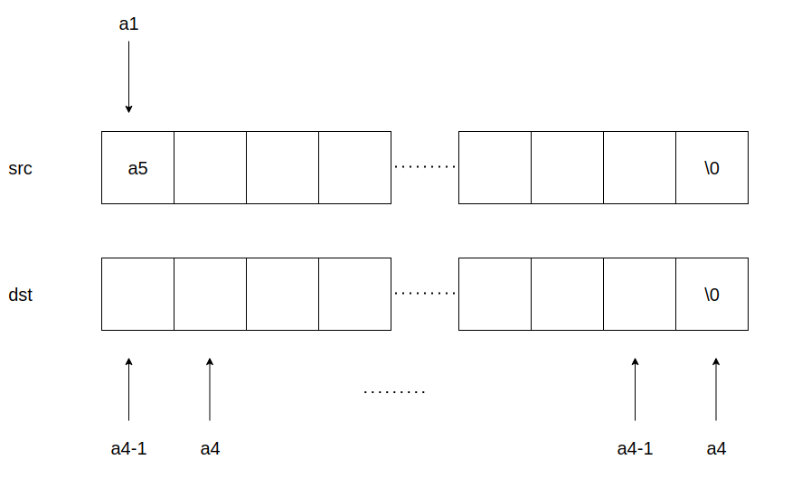

原先 string copy 過程: 
1. 初始: 將 ```a4``` 指向 dst, ```a1``` 指向 ```src```, 並且將 ```a1```  指向內容 load 到 ```a5``` 中, 第一次先判斷 a5 是否為 0, 是的話直接 return, 否的話進入 step2
2. 將 ```a4``` 往後移一位置, 並將 ```a5``` 放到 ```a4-1``` 位置, 也就是說 a4 永遠指向 dst 最尾端的地方, 永遠比 src 多指向一個 element, 接著移動 ```a1``` 到下一個位置並更新 ```a5```, 若 a5 此時非 0 回到 step2
3. 補 0 到 a4, return 

上述過程可以知道 load-used instruction 的產生明顯與這個 string copy 過程有關系, 我們可以**調動指令順序**就可以避免掉了, 更動方式就是將 ```a4``` 指向當下要 copy 過去的位置, 非下一個位置, 最後補 0 的時候補在 ```a4+1``` 即可:

```c
char *strcpy(char *dst, char *src)
{
    asm volatile("lbu	a5,0(a1)");
    asm volatile("mv	a4,a0");
    asm volatile("beqz	a5,copy_end");
    asm volatile("copy:");
    asm volatile("sb	a5,0(a4)");
    asm volatile("addi	a1,a1,1");
    asm volatile("lbu	a5,0(a1)");
    asm volatile("addi	a4,a4,1");
    asm volatile("bnez	a5,copy");
    asm volatile("copy_end:");
    asm volatile("sb	zero,1(a4)");
    asm volatile("ret");
}
```

```asm
00001ea0 <strcpy>:
    1ea0:	0005c783          	lbu	a5,0(a1)
    1ea4:	00050713          	mv	a4,a0
    1ea8:	00078c63          	beqz	a5,1ec0 <copy_end>

00001eac <copy>:
    1eac:	00f70023          	sb	a5,0(a4)
    1eb0:	00158593          	addi	a1,a1,1
    1eb4:	0005c783          	lbu	a5,0(a1)
    1eb8:	00170713          	addi	a4,a4,1
    1ebc:	fe0798e3          	bnez	a5,1eac <copy>

00001ec0 <copy_end>:
    1ec0:	000700a3          	sb	zero,1(a4)
    1ec4:	00008067          	ret
    1ec8:	00008067          	ret
```

在單單這樣調換指令順序的方式上, DMIPS 上升到 ```0.74```, 現在到 waveform 查看變動, 我們預期在改掉 load-used instruction 後應該不會存在 data hazard, 因此預期在 memory stage 執行: ```1ea0```(只會一次), ```1eac```, ```1eb4``` , ```1ec0```(只會一次) 這幾條指令時才會出現 stall, 其他指令不應該出現 stall, 推算總共應該花費的 cycle 數: 
1. init: 4=2+1+1 (branch predict 猜對, 不會有 penalty)

    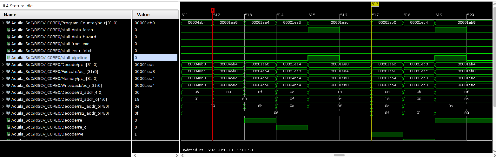

2. iter: 9*1(branch 猜錯需要到 execute stage決定)

    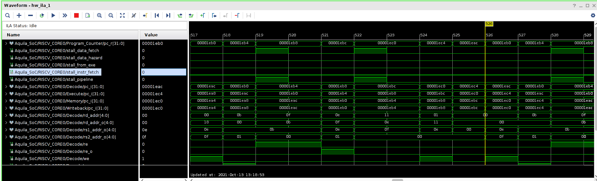

3. iter: 6*29

    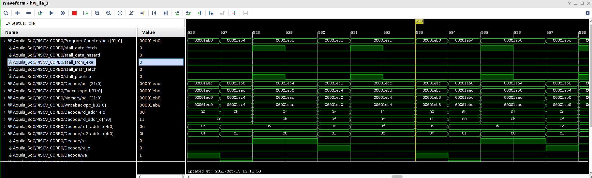

    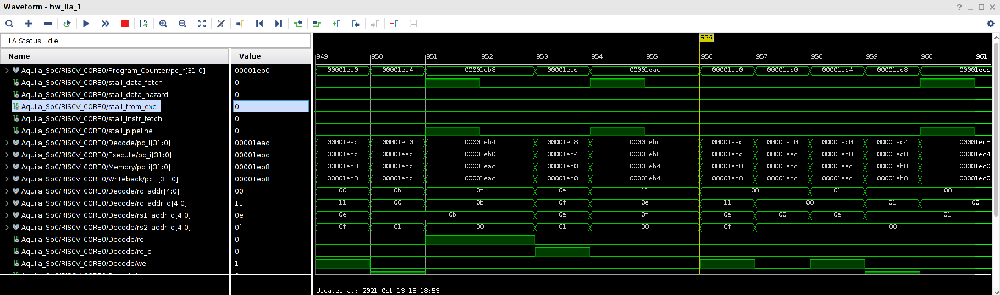

4. 結束後馬上又下一次的 string copy, 可以發現這次從第一次開始就猜對了

    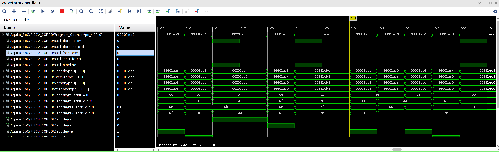

    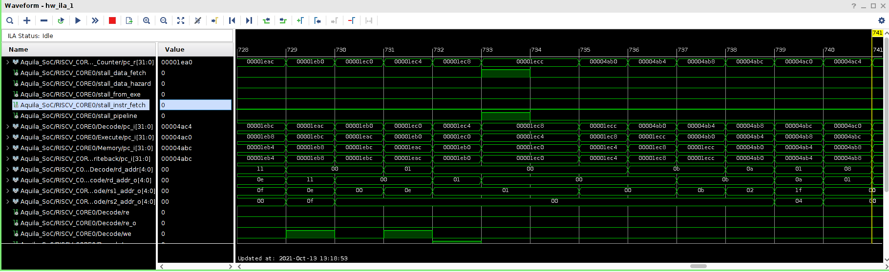

    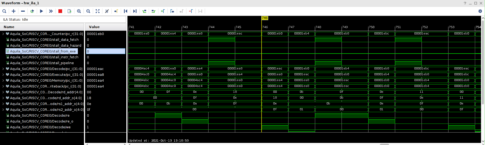

### unroll strcpy

short version, middle part*29:

```anm
asm volatile("lbu	a5,0(a1)");
asm volatile("mv	a4,a0");
asm volatile("sb	a5,0(a4)");

asm volatile("addi	a1,a1,1");
asm volatile("lbu	a5,0(a1)");
asm volatile("addi	a4,a4,1");
asm volatile("sb	a5,0(a4)");

asm volatile("sb	zero,1(a4)");
asm volatile("ret");
```

```c
char *strcpy(char *dst, char *src)
{
    asm volatile("lbu	a5,0(a1)");
    asm volatile("mv	a4,a0");
    asm volatile("sb	a5,0(a4)");
    asm volatile("addi	a1,a1,1");
    asm volatile("lbu	a5,0(a1)");
    asm volatile("addi	a4,a4,1");
    asm volatile("sb	a5,0(a4)");
    asm volatile("addi	a1,a1,1");
    asm volatile("lbu	a5,0(a1)");
    asm volatile("addi	a4,a4,1");
    asm volatile("sb	a5,0(a4)");
    asm volatile("addi	a1,a1,1");
    asm volatile("lbu	a5,0(a1)");
    asm volatile("addi	a4,a4,1");
    asm volatile("sb	a5,0(a4)");
    asm volatile("addi	a1,a1,1");
    asm volatile("lbu	a5,0(a1)");
    asm volatile("addi	a4,a4,1");
    asm volatile("sb	a5,0(a4)");
    asm volatile("addi	a1,a1,1");
    asm volatile("lbu	a5,0(a1)");
    asm volatile("addi	a4,a4,1");
    asm volatile("sb	a5,0(a4)");
    asm volatile("addi	a1,a1,1");
    asm volatile("lbu	a5,0(a1)");
    asm volatile("addi	a4,a4,1");
    asm volatile("sb	a5,0(a4)");
    asm volatile("addi	a1,a1,1");
    asm volatile("lbu	a5,0(a1)");
    asm volatile("addi	a4,a4,1");
    asm volatile("sb	a5,0(a4)");
    asm volatile("addi	a1,a1,1");
    asm volatile("lbu	a5,0(a1)");
    asm volatile("addi	a4,a4,1");
    asm volatile("sb	a5,0(a4)");
    asm volatile("addi	a1,a1,1");
    asm volatile("lbu	a5,0(a1)");
    asm volatile("addi	a4,a4,1");
    asm volatile("sb	a5,0(a4)");
    asm volatile("addi	a1,a1,1");
    asm volatile("lbu	a5,0(a1)");
    asm volatile("addi	a4,a4,1");
    asm volatile("sb	a5,0(a4)");
    asm volatile("addi	a1,a1,1");
    asm volatile("lbu	a5,0(a1)");
    asm volatile("addi	a4,a4,1");
    asm volatile("sb	a5,0(a4)");
    asm volatile("addi	a1,a1,1");
    asm volatile("lbu	a5,0(a1)");
    asm volatile("addi	a4,a4,1");
    asm volatile("sb	a5,0(a4)");
    asm volatile("addi	a1,a1,1");
    asm volatile("lbu	a5,0(a1)");
    asm volatile("addi	a4,a4,1");
    asm volatile("sb	a5,0(a4)");
    asm volatile("addi	a1,a1,1");
    asm volatile("lbu	a5,0(a1)");
    asm volatile("addi	a4,a4,1");
    asm volatile("sb	a5,0(a4)");
    asm volatile("addi	a1,a1,1");
    asm volatile("lbu	a5,0(a1)");
    asm volatile("addi	a4,a4,1");
    asm volatile("sb	a5,0(a4)");
    asm volatile("addi	a1,a1,1");
    asm volatile("lbu	a5,0(a1)");
    asm volatile("addi	a4,a4,1");
    asm volatile("sb	a5,0(a4)");
    asm volatile("addi	a1,a1,1");
    asm volatile("lbu	a5,0(a1)");
    asm volatile("addi	a4,a4,1");
    asm volatile("sb	a5,0(a4)");
    asm volatile("addi	a1,a1,1");
    asm volatile("lbu	a5,0(a1)");
    asm volatile("addi	a4,a4,1");
    asm volatile("sb	a5,0(a4)");
    asm volatile("addi	a1,a1,1");
    asm volatile("lbu	a5,0(a1)");
    asm volatile("addi	a4,a4,1");
    asm volatile("sb	a5,0(a4)");
    asm volatile("addi	a1,a1,1");
    asm volatile("lbu	a5,0(a1)");
    asm volatile("addi	a4,a4,1");
    asm volatile("sb	a5,0(a4)");
    asm volatile("addi	a1,a1,1");
    asm volatile("lbu	a5,0(a1)");
    asm volatile("addi	a4,a4,1");
    asm volatile("sb	a5,0(a4)");
    asm volatile("addi	a1,a1,1");
    asm volatile("lbu	a5,0(a1)");
    asm volatile("addi	a4,a4,1");
    asm volatile("sb	a5,0(a4)");
    asm volatile("addi	a1,a1,1");
    asm volatile("lbu	a5,0(a1)");
    asm volatile("addi	a4,a4,1");
    asm volatile("sb	a5,0(a4)");
    asm volatile("addi	a1,a1,1");
    asm volatile("lbu	a5,0(a1)");
    asm volatile("addi	a4,a4,1");
    asm volatile("sb	a5,0(a4)");
    asm volatile("addi	a1,a1,1");
    asm volatile("lbu	a5,0(a1)");
    asm volatile("addi	a4,a4,1");
    asm volatile("sb	a5,0(a4)");
    asm volatile("addi	a1,a1,1");
    asm volatile("lbu	a5,0(a1)");
    asm volatile("addi	a4,a4,1");
    asm volatile("sb	a5,0(a4)");
    asm volatile("addi	a1,a1,1");
    asm volatile("lbu	a5,0(a1)");
    asm volatile("addi	a4,a4,1");
    asm volatile("sb	a5,0(a4)");
    asm volatile("addi	a1,a1,1");
    asm volatile("lbu	a5,0(a1)");
    asm volatile("addi	a4,a4,1");
    asm volatile("sb	a5,0(a4)");
    asm volatile("addi	a1,a1,1");
    asm volatile("lbu	a5,0(a1)");
    asm volatile("addi	a4,a4,1");
    asm volatile("sb	a5,0(a4)");
    asm volatile("sb	zero,1(a4)");
}
```

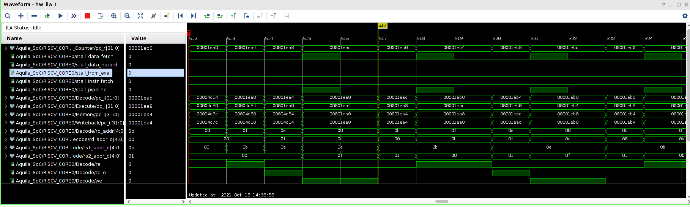

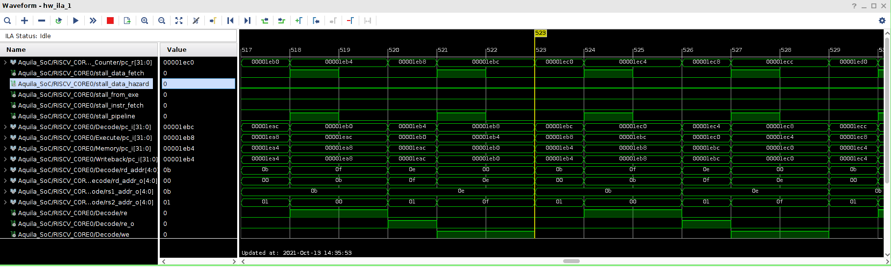

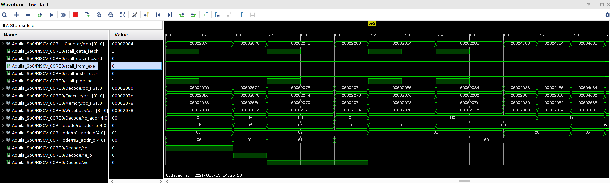

### change strcmp asm code sequence

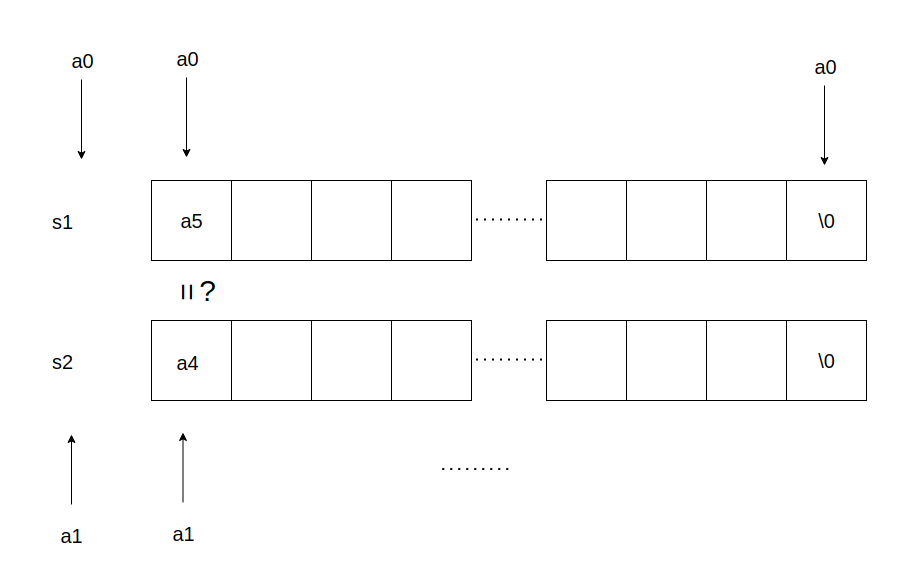

追根究底與 ```strcpy``` 的原因相同, 都是因為 load-used instruction 造成, 我們只要想辦法在 compare 之前就 load 出來, 再變動 pointer 即可:


## summary

|strategy id|DMIPS|
|:---:|:---:|
|原始不改動|0.72|
|FreeBSD strcpy|0.74|
|FreeBSD strcmp|0.74|
|FreeBSD strcpy+strcmp|0.77|
|調換 strcpy asm code|0.75|
|unroll strcpy|0.78|
|調換 strcmp asm code|0.74|
|strcpy unroll+調換 strcmp asm code|0.81|