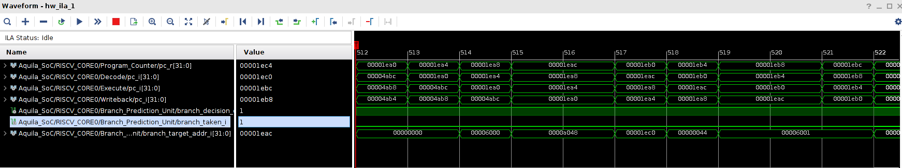
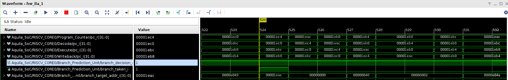

# HW2 Branch Predictor

## prerequisite

1. 修改 ```dhry_1.c``` 可以顯示小數點後更多位數
2. 使用老師釋出的 string.c 應該可以達到 **0.90342** DMIPS, 以此作為初始值

## trace code





* bpu.v
    * 當不在 branch table 中的 branch instruction 第一次進入 decode stage 時將會判斷 ```is_cond_branch``` 和 ```is_jal_i```， 並將訊號送往 execute 與 bpu, 在 instruction 位於 execute stage 時觸發 bpu.v 中的 ```we``` 訊號，表示當前這個指令是 branch 且未出現在表上，需要加進表中,**需要特別注意到一點是一旦出現這種不在表上的 branch instruction 時第一次一定不會做 branch prediction, 一定要經過初始化後才會開始做預測**， 因此 ```we``` 訊號會繼續往下做下列的事情:
        1. 尋找當前要寫入 table 的 idx(```write_addr```), ```ENTRY_NUM``` 表示表的欄位數量

            ```verilog
            always @(posedge clk_i)
            begin
                if (rst_i)
                begin
                    write_addr <= 0;
                end
                else if (stall_i)
                begin
                    write_addr <= write_addr;
                end
                else if (we)
                begin
                    write_addr <= (write_addr == (ENTRY_NUM - 1)) ? 0 : write_addr + 1;
                end
            end
            ```
        2. 將當前此 instruction 的 pc (也就是 decode 的 ```pc_i```) 寫入表內
            ```verilog
            integer idx;
            always @(posedge clk_i)
            begin
                if (rst_i)
                begin
                    for (idx = 0; idx < ENTRY_NUM; idx = idx + 1)
                        branch_pc_table[idx] <= 0;
                end
                else if (stall_i)
                begin
                    for (idx = 0; idx < ENTRY_NUM; idx = idx + 1)
                        branch_pc_table[idx] <= branch_pc_table[idx];
                end
                else if (we)
                begin
                    branch_pc_table[write_addr] <= dec_pc_i;
                end
            end
            ```
        3. 初始化狀態機的狀態:
            ```verilog
            if (we) // Execte the branch inastruction for the first time.
            begin
                branch_likelihood[write_addr] <= {branch_taken_i, branch_taken_i};
            end
            ```


## without branch predict

考慮不使用 branch predict 的情況, 每次遇到 branch 指令時將會繼續往下執行, 直到 branch 的結果在 pipeline 中 execute stage 完成後, 但加上 branch predict 後, 假設結果預測正確, 就會得到不需要 flush 的情況; 反之, 如果預設結果不正確, 我們也只會變成跟不使用 branch predict 時一樣的情況, 需要 flush 而浪費一些 cycle, 因此我們可以推測出在使用 branch predict 的一般情況中必定會得到好處進而讓 DMIPS 上升

。使用老師提供的 ```string.c``` 後如果不包含 branch predict, DMIPS 將會從 **0.90342** 掉到 **0.87832**, 如果使用自己在 HW1 的修改將 branch predict 從中移除，DMPIS 將會從 **0.77** 掉到 **0.65**，可以看到 branch predict 的重要性。

* 關掉 branch predict 的方法:
    * ```program_counter.v``` 中:
        ```verilog
        `ifndef disable_branch_prediction
            // with branch predictor
            if (is_fencei_i)
                pc_r <= dec_pc_i;
            else
            if (exe_branch_taken_i & !dec_branch_hit_i)
                pc_r <= exe_branch_target_addr_i;
            else if (exe_branch_misprediction_i)
                pc_r <= dec_branch_decision_i ? exe_branch_restore_addr_i : exe_branch_target_addr_i;
            else if (sys_jump_i)
                pc_r <= sys_jump_data_i;
            else if (bpu_branch_hit_i & bpu_branch_decision_i)
                pc_r <= bpu_branch_target_addr_i;
            else
                pc_r <= pc_increment;
        `else
            // without branch predictor
            if (is_fencei_i)
                pc_r <= dec_pc_i;
            else if (exe_branch_taken_i) pc_r <= exe_branch_target_addr_i;
            else if (sys_jump_i) pc_r <= sys_jump_data_i;
            else pc_r <= pc_increment;
        `endif
        end
        ```
    * ```pipeline_control.v```:
        ```verilog
        `ifndef disable_branch_prediction
            // with branch predictor
            assign branch_flush = (branch_taken_i & !branch_hit_i) |
                                branch_misprediction_i;
        `else
            // without branch predictor
            assign branch_flush = branch_taken_i;
        `endif
        ```
    * 因此只要事先 define ```disable_branch_prediction``` 即可關閉 branch predict
        ```verilog
        // core_top.v
        `define disable_branch_prediction 0;
        ```

## optimize 2-bit predictor

* 觀察 branch predict 效用與效力如何, 是否隨著 branch size 越高而 DMIPS 隨著上升
1. without branch predict
2. 將 branch predict table 欄位數從 32 改到 64 
3. 將 branch predict table 欄位數從 32 下修到 16 
4. initial finite state machine states

## implement two-level predictor

採用 gshare 方式, 剩下請見 [0711282.pdf](./0711282.pdf), 自己覺得這次寫的挺詳細的XD