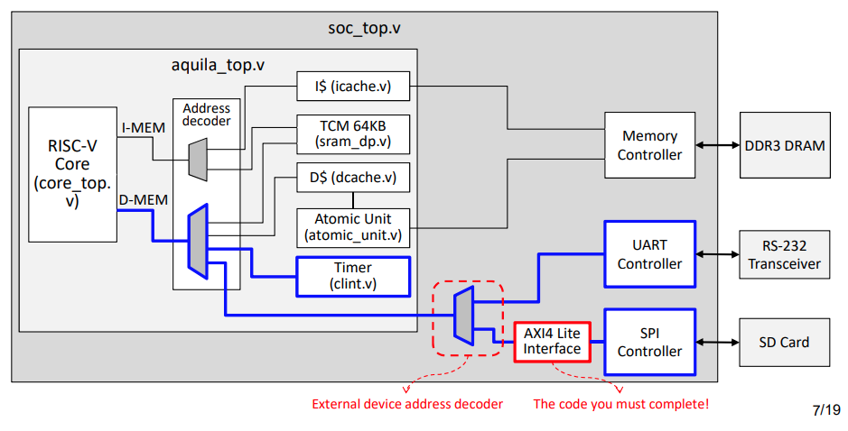
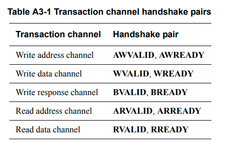
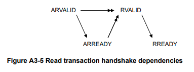
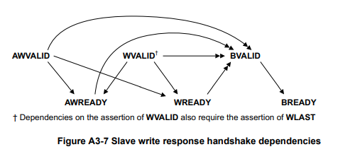
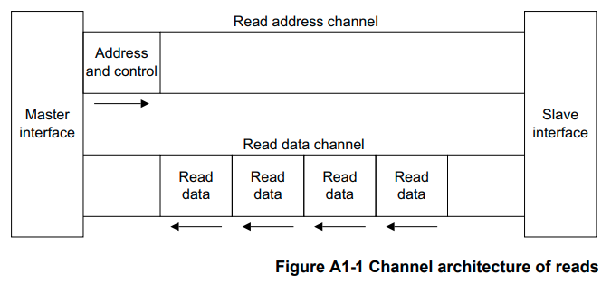
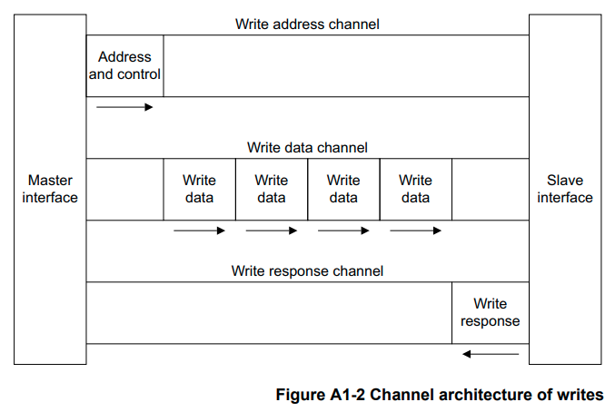

# HW4



實做 axi4 lite bus，axi4 含有下列五個 channel

* axi4 bus，粗體表示這次作業尚未接好的訊號
    1. Read address bus (axi_araddr, axi_arvalid, axi_arready)
    2. Read data bus (axi_rdata, axi_rvalid, axi_rready, axi_rresp)
    3. Write address bus (**axi_awaddr**, **axi_awvalid**, axi_awready)
    4. Write data bus (**axi_wdata**, **axi_wvalid**, axi_wready, **axi_wstrb**)
    5. Write response bus (axi_bvalid, axi_bresp, **axi_bready**)

## introdution to AXI4

AXI 架構含有五個 channel,需要注意的是我們這邊實做的是 AXI lite，原本的 AXI4 一些訊號可能會少調一些, 下面切成 read, write 進行討論

### terminalogy

這邊需要定義一些 AXI4 內會使用到的 terminalogy

* AXI4 為 master-slave 架構
* beat: 要傳輸的數據，一個 beat 含有一個待傳輸數據, 
* burst: 一次傳輸的一段數據, 含有一個或多個 beats
* transaction: 由 master init 一段 transaction 後, 即可開始與 slave 做溝通

### Handshake 

(位於 SPEC-3.2)

五個 channel 皆以 handshake 做傳輸控制, 在 Handshake process 中含有兩訊號, **valid** 與 **ready**, 而在 handshake 中 master 與 slave 互相扮演發送發接收方, 且因為 AXI4 為雙向都可以控制傳輸速度, 由發送方負責 valid 表示要傳輸的訊號資料都準備好可以傳送了, 由接收方發出 ready 訊號表示可以接收傳輸的資料了, **只有 valid 與 ready 都拉高的時候才可以傳輸數據**

* 發送過程可能出現的情況
    * 同時到達: naive
    * valid 比 ready 早到達: 表示接收方可能還沒準備好可以接收資料, 但此時完全可以就讓傳送方繼續 wait 直到接收方可以完成, 因此在這裡可以假定一旦 valid 拉高為 1 就不會在拉低下去
    * ready 比 valid 早到達: 表示發送方還沒準備好可以發送資料, 但此時接收方已經準備好了, 需要注意的是 ready 拉高後仍然有可能變成 0 表示我現在又沒辦法接收了
* 根據上面的描述
    * 以 ready 的視角來看, valid 可以作為他的條件, 大概是 ```ready=valid&other...``` 的形式
    * 以 valid 的視角來看, **ready 不可以作為他的條件** 因為一定又寫成 ```valid=ready&other...``` 的形式, 有可能造成 deadlock
    * 因此可以由接收方下手, 因為 valid 保證拉高後就不會下降, 也就是把 valid 設定為其條件
    * 結論: **valid 不准依賴 ready, ready 可以依賴 valid**
* 五個 channel 各自的 valid 與 ready



### transaction

* basic rule:
    1. valid 信號一旦拉高後就不可以拉低, 反之, ready 可以拉高後拉低(變成還沒辦法接收資料的狀態)
    2. valid 不准依賴 ready，ready 可以依賴 valid
    3. ready 基本上可以預設為 1， 如果預設是拉低此訊號, 那如果需要拉高此訊號的話需要先拉高 valid 再拉高 ready, 共耗費兩個 clock cycle



* basic rule
    * ```ARREADY``` 不依賴 ```ARVALID``` (可在 valid 訊號之前或是之後拉起)
    * ```RREADY``` 不依賴 ```RVALID``` (可在 valid 訊號之前或是之後拉起)
* ```RVALID``` 依賴 ```ARVALID``` 與 ```ARREADY```




* basic rule
    * ```AREADY``` 不依賴 ```AWVALID```
    * ```WREADY``` 不依賴 ```WVALID```
    * ```BREADY``` 不依賴 ```BVLAID```
* ```BALID``` 依賴於 ```AWVALID```, ```AWREADY```, ```WVALID```, ```WREADY```
* ```AWVALID``` 不依賴 ```WREADY```, ```WVALID``` 不依賴 ```AWREADY```: 因為無論是先傳 address 還是先傳 data 都不影響

### read address channel

spec 上提到下列:

>The master can assert the ARVALID signal only when it drives valid address and control information. When
>asserted, ARVALID must remain asserted until the rising clock edge after the slave asserts the ARREADY signal.
>The default state of ARREADY can be either HIGH or LOW. This specification recommends a default state of
>HIGH. If ARREADY is HIGH then the slave must be able to accept any valid address that is presented to it.

與推薦設定方式:

>This specification does not recommend a default ARREADY value of LOW, because it forces the transfer to take
>at least two cycles, one to assert ARVALID and another to assert ARREADY.

|signal|direction|description|
|:---:|:---:|:----:|
|ARVALID|master->slave|master 只能在準備好 address 與控制訊號後才可拉高 ```ARVALID```|
|ARREADY|slave->master|spec 推薦預設就拉高此訊號, 因為像是前面說的 valid 會是 ready 的條件, <br> 因此如果預設是拉低此訊號, <br> 那如果需要拉高此訊號的話需要先拉高 valid 再拉高 ready, 共耗費兩個 clock cycle|

老師在這個 channel 已經幫我們做好了, 可以作為範例看一下他們怎麼做的:

```verilog
always @(posedge clk)
begin
    if (rst)
        axi_arvalid <= 0;
    else if (dev_strobe & spi_sel & ~dev_we)
        axi_arvalid <= 1;
    else if (axi_arready & axi_arvalid)
        axi_arvalid <= 0;   
    else
        axi_arvalid <= axi_arvalid;
end

always @(posedge clk) // Read Addresses
begin
    if (rst)
        axi_araddr <= 0;
    else if (dev_strobe & spi_sel & ~dev_we)
        axi_araddr <= dev_addr[6 : 0];
end
```





### write channel



## ref

* [AXI4-Lite Interface](https://www.realdigital.org/doc/a9fee931f7a172423e1ba73f66ca4081)
* [深入 AXI4 总线（一）握手机制](https://zhuanlan.zhihu.com/p/44766356)